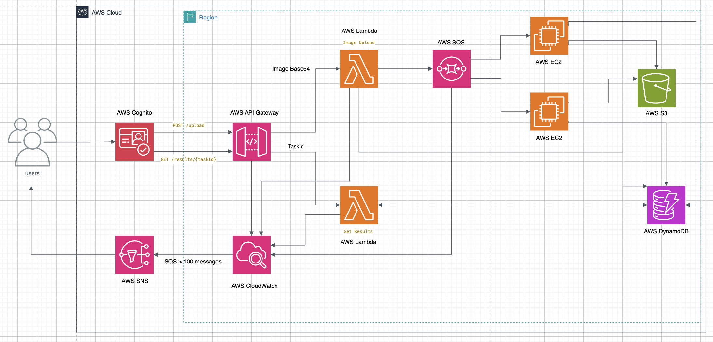

# Image Recognition System on AWS

**Image Recognition System** is a cloud-based platform developed for the **Cloud Computing Term Assignment** at Dalhousie University. It enables users to upload images, which are processed using machine learning models to identify objects within the images. Built on Amazon Web Services (AWS), this system is designed to be scalable, secure, and cost-effective, providing a seamless experience for image classification tasks (e.g., identifying animals or objects). The React-based frontend interfaces with a serverless and event-driven backend to deliver a robust user experience.

---

## Features

- 🔐 **User Authentication**: Secure login and signup via AWS Cognito
- 📤 **Image Upload and Processing**: Seamless image uploads through AWS API Gateway and Lambda
- ⏳ **Asynchronous Task Handling**: Efficient processing with Amazon SQS and EC2 Auto Scaling
- 💾 **Results Storage and Retrieval**: Fast access to task metadata and results using Amazon DynamoDB
- 📊 **Monitoring and Notifications**: Real-time system health tracking with Amazon CloudWatch and SNS
- 🌐 **Responsive Frontend**: User-friendly web interface hosted on Amazon S3
- ⚙️ **Infrastructure as Code**: Automated deployment with Terraform

---

## Architecture Diagram

Below is the architecture diagram illustrating the system’s components and their interactions:

---

## Tech Stack

- **Frontend**: React (JavaScript)
- **Backend**: Python (AWS Lambda, EC2)
- **Compute**: AWS Lambda, Amazon EC2
- **Storage**: Amazon S3, Amazon DynamoDB
- **Messaging**: Amazon SQS
- **Authentication**: AWS Cognito
- **Monitoring**: Amazon CloudWatch, Amazon SNS
- **Infrastructure**: Terraform
- **Image Processing**: OpenCV (Python)
- **Deployment**: AWS CLI

---